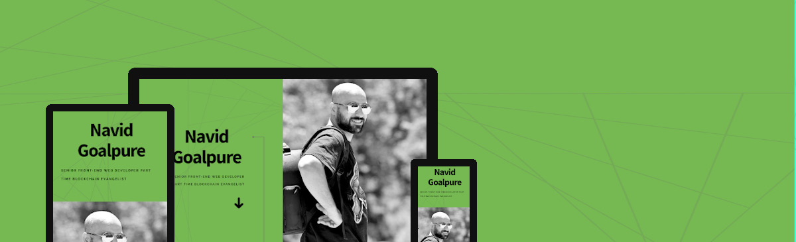

# My react resume website

Gatsby.js V2 starter template based on Paradigm Shift by HTML5 UP

For an overview of the project structure please refer to the [Gatsby documentation - Building with Components](https://www.gatsbyjs.org/docs/building-with-components/).
This project is forked from [here](https://github.com/anubhavsrivastava/gatsby-starter-paradigmshift.git)


## Screenshot



## Install

Make sure that you have the Gatsby CLI program installed:

```sh
npm install --global gatsby-cli
```

And run from your CLI:

```sh
gatsby new <site-name> https://github.com/anubhavsrivastava/gatsby-starter-paradigmshift
```

Then you can run it by:

```sh
cd gatsby-example-site
npm install
gatsby develop
```

### Personalization

Edit `config.js` to put up your details

```javascript
module.exports = {
  siteTitle: 'Gatsby Starter Paradigmshift', // <title>
  ...
  heading: 'Anubhav',
  subHeading: 'Web Developer',
  // social
  socialLinks: [
    {
      icon: 'fa-github',
      name: 'Github',
      url: 'https://github.com/anubhavsrivastava',
    }
    ...
  ],
};

```

And Edit `componentsData.js` to put up details to components

```javascript

import React from 'react'

export default {
  employment: [
    {
      duration: '2017-2020',
      title: 'FRONT-END DEV',
      companyName: 'Hivaland',
      characters: [
        'bloock.ir : One of the first blockchain startups in Iran to create a platform for renting books on the ethereum blockchain.',
        'steemAce: A social network on Steem blockchain.',
        'bitseen.com : An exchange for crypto currencies.',
        'Technologies: ReactJs, GatsbyJs, NodeJs, GraphQL, Solidity.',
      ],
  ...
  }
  ...
  ]
  ...
}
```
### Alarm
In this project you will find competing solutions side by side. For example, this project uses SCSS and CssInJS, Contex and Redux and so on.
That's because I wanted to showcase my ability to use different technologies. Obviously, in a real project, your goal is to achieve project integrity, and avoid using as many competing technologies as possible.
### License

[](LICENSE)

refer `LICENSE` file in this repository.
